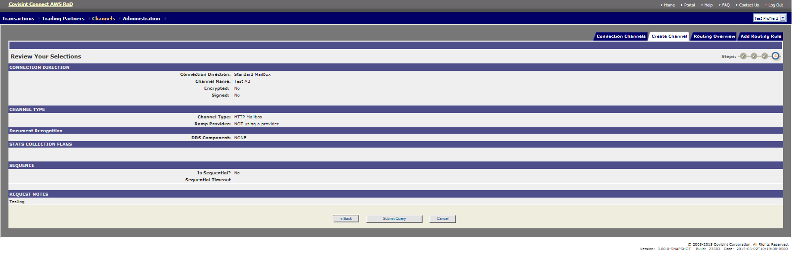

# Create Channel (Connection)
## Description
Creating a Channel (connection) in messaging application.
## Who can perform this function?
* **Messaging Administrator** – Can create channel for any Trading Partner
* **Tenant Administrator** – Can create channel for Trading Partner owned by their Tenant (Solution).

## Steps
1. Log into Messaging application.
2. Verify that the Profile displayed in the top left corner of the screen is that which you wish to modify. (If it is not, select the appropriate profile from the Profile drop down menu).
3. Click on **Channel** Tab and select **Create channel** sub menu option.
4. Select manner of connection and click **Continue**.
5. Select Channel Type and click on ** Continue**.
6. Enter required fields marked red.
7. Click on ** Continue**.
8. Review selections and click on ** Submit Query**.

##Results
Channel is successfully created.

