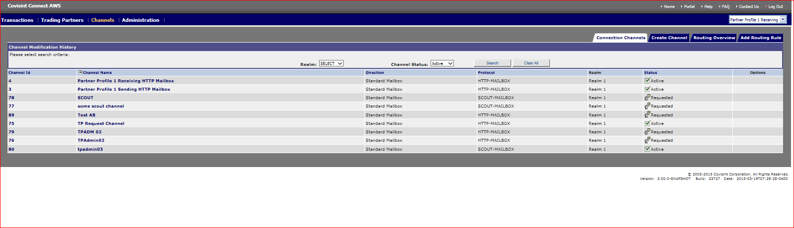
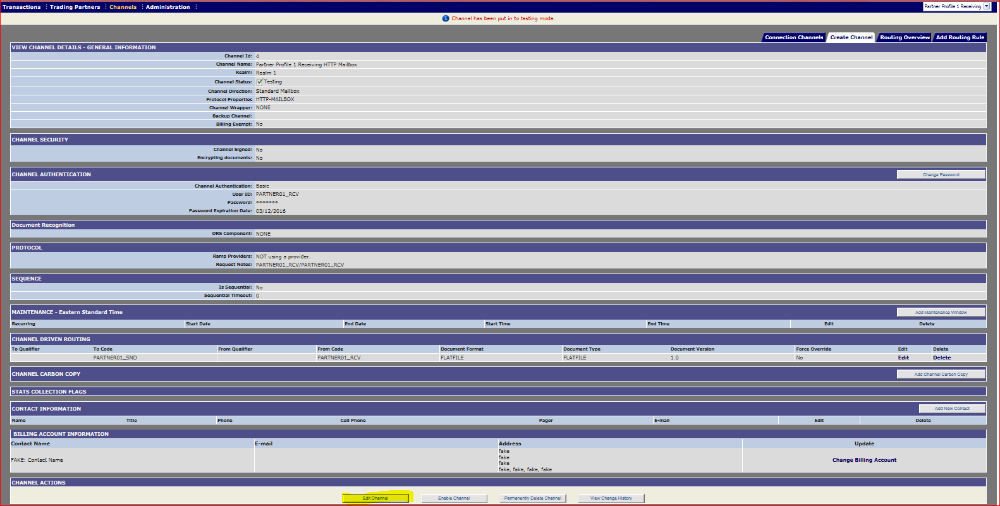
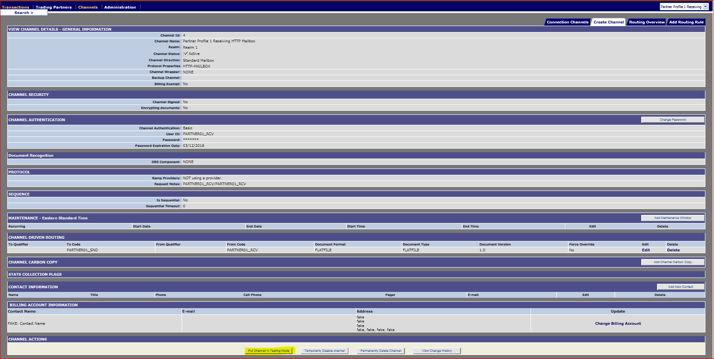
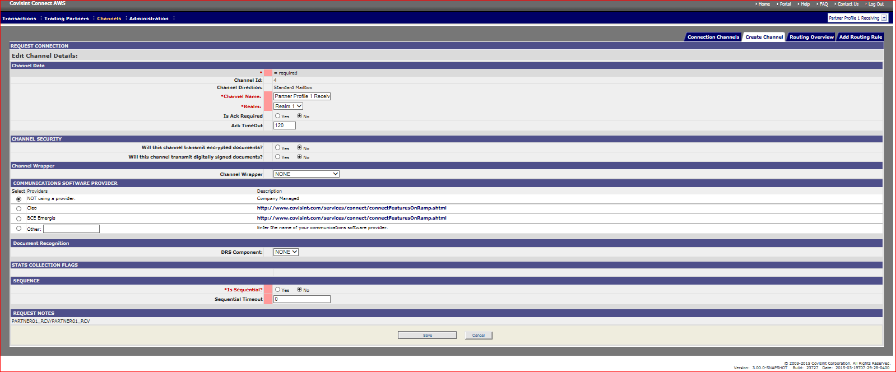

# Edit Channel
## Description
Edit/update channel (Connection)
## Who can perform this function?
* **Messaging Administrator** – Can edit any Channel
* **Tenant Administrator** – Can edit only Channel owned by their Tenant (Solution).

## Steps
1. Log into Messaging application.
2. Verify that the Profile displayed in the top left corner of the screen is that which you wish to modify. (If it is not, select the appropriate profile from the Profile drop down menu).
3. Click on Channel tab.
4. Screen defaults to **Connection Channels**.

5. Click on channel to be edited.
6. View channel details screen is displayed. Scroll down to the bottom of the screen and click on **Edit Channel** button.

7. Edit desired fields and click **Save**.

8. Update Confirmation message is displayed.

## Results
You have successfully edited an existing Channel.

