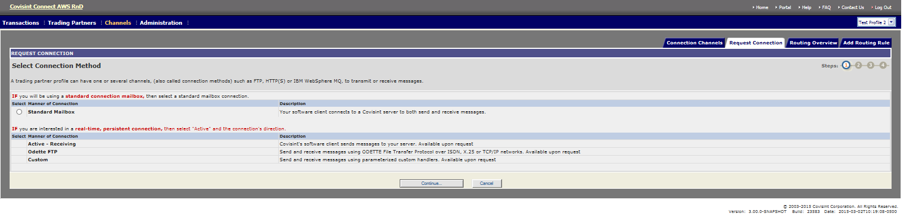

# Request for Connection (Channel)
## Description
Requesting for Channel (connection) through messaging application.

**Messaging Administrator** – Can request channel for any Trading Partner
* **Tenant Administrator** – Can request channel for Trading Partner owned by their Tenant (Solution).
* **Trading Partner Administrator** - Can request channel for trading partners they are administrators of.

## Steps
1. Log into Messaging application.
2. Verify that the Profile displayed in the top left corner of the screen is that which you wish to modify. (If it is not, select the appropriate profile from the Profile drop down menu).
3. Click on **Channel** Tab and select **Request Connection** sub menu option.
4. Select manner of connection, channel type and other required fields and request for channel.
5. System will display message of confirmation and appropriate person will be informed of the request.

## **Results**
You have requested for channel successfully.

