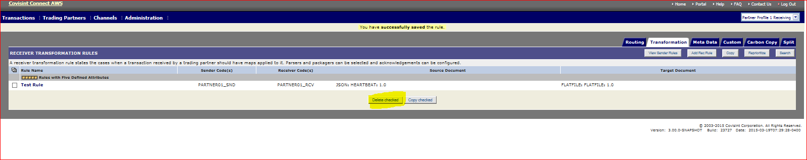

# Delete a Rule
## Description
Delete existing Rule
## Who can perform this function?
* **Messaging Administrator** – Can delete any Rules for any trading Partner.
* **Tenant Administrator** – Can delete only Rules for Trading Partner owned by their Tenant (Solution).

## Steps
1. Log into Messaging application.
2. Verify that the Profile displayed in the top left corner of the screen is that which you wish to modify. (If it is not, select the appropriate profile from the Profile drop down menu).
3. Click on Channel tab.
4. Screen defaults to **Connection Channels**.
5. Click on ** Routing Overview **
6. Screen defaults to Routing Rules list.
7. Click on desired rule type from sub menu bar – ** Routing, Transformation, Custom, Carbon copy or Splitter **
8.  Select rule/s by checking the check box to delete

9. Click on ** Delete Checked ** button.
10. System displays confirmation message.

## Results
You have successfully deleted an existing Rule.
