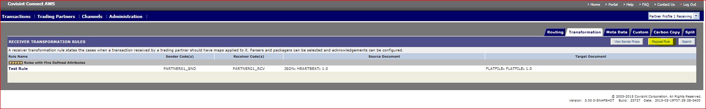

# Request Rules
## Description
Requesting for Trading Partner rules through messaging application.
## Who can perform this function?
* **Messaging Administrator** – Can request all types rules for any Trading Partner
* **Tenant Administrator** – Can request all types rules for Trading Partner owned by their Tenant (Solution).
* **Trading Partner Administrator** - Can request all types rules for trading partners they are administrators of.

## Steps
1. Log into Messaging application.
2. Verify that the Profile displayed in the top left corner of the screen is that which you wish to modify. (If it is not, select the appropriate profile from the Profile drop down menu).
3. Click on **Channel** Tab and select **Add routing Rule** or ** Routing Overview ** sub menu option.

4.  In next screen, tabs for each rule type is displayed. Click on ** Transformation **, ** Meta Data ** , ** custom ** , or ** Split ** to request specific rule type.

5. Click on ** Request Rule ** button.
6. In the open text field, to the best of your ability, key in a description of your request.
7. Click Submit Mapping Request.
8. System will display message of confirmation and appropriate person will be informed of the request.

## **Results**
You have requested for a rule successfully.
