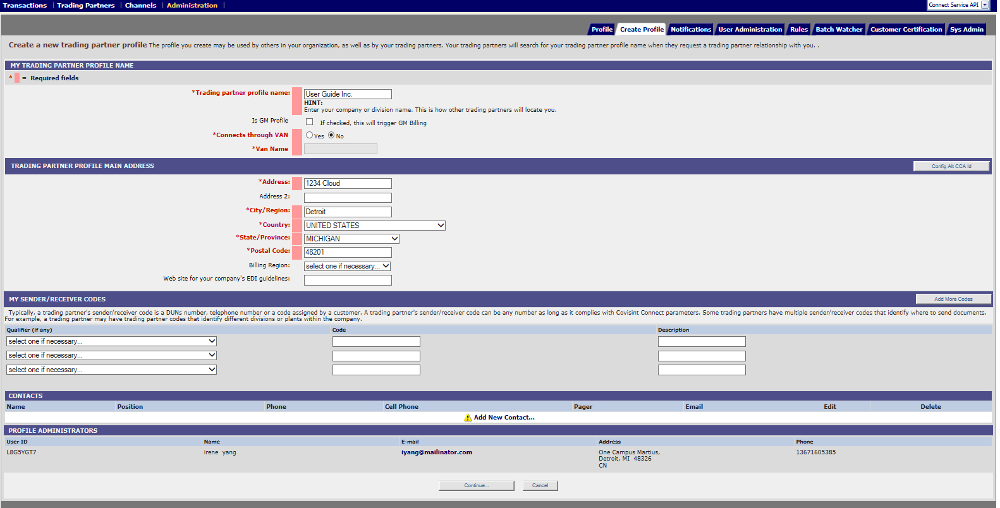

# Add or Edit Sender/Receiver Codes
## Description
Edit/update Sender/Receiver Code
## Who can perform this function
* **Messaging Administrator** – Can perform for any Trading partner
* **Tenant Administrator** – Can perform only for Trading Partner owned by their Tenant (Solution).

##Steps
1. Log into Messaging system.
2. Select Profile from 'Profile menu" dropdown at top right hand corner.

3. From the Administration menu, click Profile tab.
4. Click Add More Codes.
5. From the drop-down menu, select the code qualifier (if desired).
6. Key in the required code.
7. Key in the code description.
8. Click Save Code. The screen refreshes, and the main Profile tab is displayed with a confirmation of the updated information.

## Results

New code is added to profile successfully
