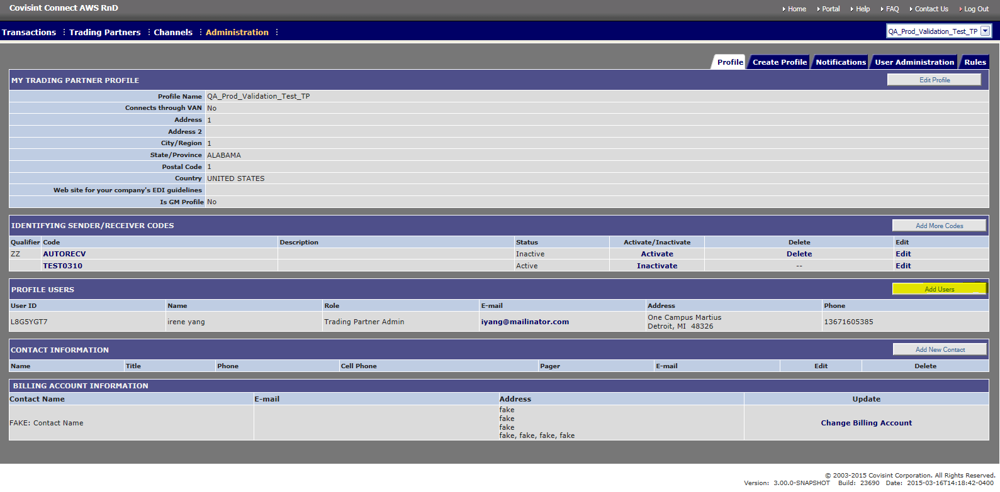

# Add Users to Profile
## Description
Users may belong to more than one Trading Partner profile. Administration of a user is performed on a per-profile basis.
Users listed in search action have already met the following criteria:
* received a Covisint User ID and Password.
* been approved by their Security Administrator for their organizations
* are approved by their Security Administrator to access the Covisint Connect application.

## Who can perform this function
* **Messaging Administrator** – Can perform for any Trading partner.
* **Tenant Administrator** – Can perform only for Trading Partners owned by their Tenant (Solution).

##Steps
1. Log into Messaging system.
2. Select Profile from 'Profile menu" dropdown at top right hand corner.
3. From the Administration menu, click **Profile** tab.
4. Click **Add Users**.
5. Enter one or more search criteria (F.NAme, L.Name, Email ID or User ID).
6. Click on Find User
7. Select user form list presented.
8. Click Add

##Results
You have successfully added a new user to a trading partner profile.
