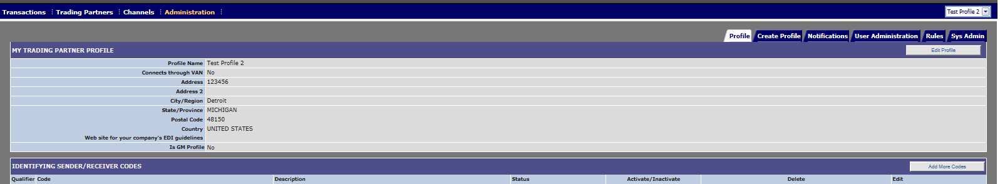

# Edit Trading Partner
## Description
Edit/update Trading partner profile
## Who can perform this function
* **Messaging Administrator** – Can edit any Trading partner
* **Tenant Administrator** – Can edit only Trading Partner owned by their Tenant (Solution).

## Steps
1. Log into Messaging application.
2. Verify that the Profile displayed in the top left corner of the screen is that which you wish to modify. (If it is not, select the appropriate profile from the Profile drop down menu).
3. Click on Administration tab and click'Profile tab'
4. Click **Edit Profile**
5. Edit your profile information as you wish.
6. Click **Save Profile**. The screen refreshes, and the main Profile tab is displayed with a confirmation of the updated information.

## Results
You have successfully edited an existing trading partner profile.

