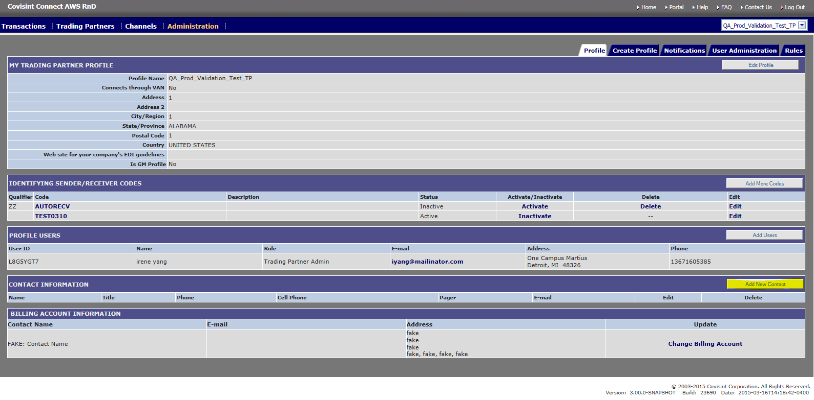

# Maintain contact information
## Description
Trading Partner Administrators must designate people to be contacted by the Covisint application administration team in the event of an emergency issue. Each Trading Partner profile must have one or more contact names listed. These contact names will be used if there is an outage, a messaging delivery issue, or if the Covisint Disaster Recovery (DR) plan has been invoked.
## Who can perform this function?
* **Messaging Administrator** – Can perform for any Trading partner.
* **Tenant Administrator** – Can perform only for Trading Partners owned by their Tenant (Solution).

##Steps
### To Add New Contact

1. Log into Messaging system.
2. Select Profile from 'Profile menu" dropdown at top right hand corner.
3. From the Administration menu, click **Profile** tab.
4. Click **Add New Contact**.
3. Key in all required information, and any additional information as desired.
4. Click **Save**. The screen refreshes, and the main Profile screen is displayed with a confirmation of the updated contact information.

###To Edit current Contact
1. Log into Messaging system.
2. Select Profile from 'Profile menu" dropdown at top right hand corner.
3. From the Administration menu, click **Profile** tab.
4. From the Edit column of the selected contact person, click Edit Contact.
5. Edit the contact's information as desired, then click Save. The confirmation box is displayed.
6. Click OK to confirm edits to this contact. The screen refreshes, and displays the updated contact information.

### delete a contact

1. From the Delete column of the selected contact name, click Delete. The confirmation box is displayed.
2. Click OK to confirm the deletion of this contact. The screen refreshes, and the contact is removed from the system.

## Results

You have successfully maintained contact information for a trading partner profile.
