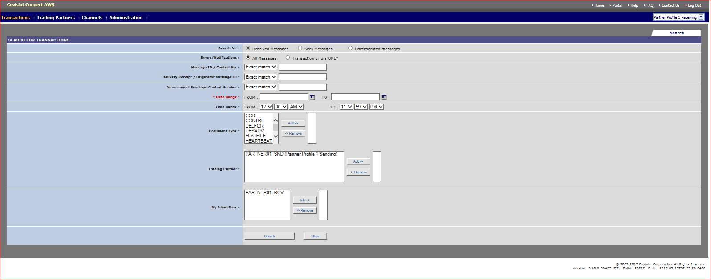
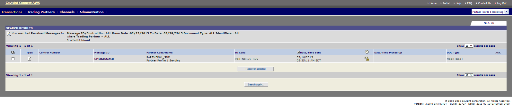

# Searching for Transaction
## Description

Transaction are messages that are sent or received using Messaging application. Users can search for transaction that are up to one week old.

## Who can perform this Function?

All users are able to search for transactions that are stored in the database via various criteria.

## Steps

1. Log into Messaging application.
2. Verify that the Profile displayed in the top left corner of the screen is that which you wish to search transactions. (If it is not, select the appropriate profile from the Profile drop down menu).
3. From the Transactions menu, mouse over Transactions > Search Transactions and click the Search Transactions link. The Search for Transactions screen is displayed.

4. Set search criteria as desired.
3. Click ** Search **. The Search Results screen is displayed.

## Results
You have successfully searched for a transaction in current trading partner.
